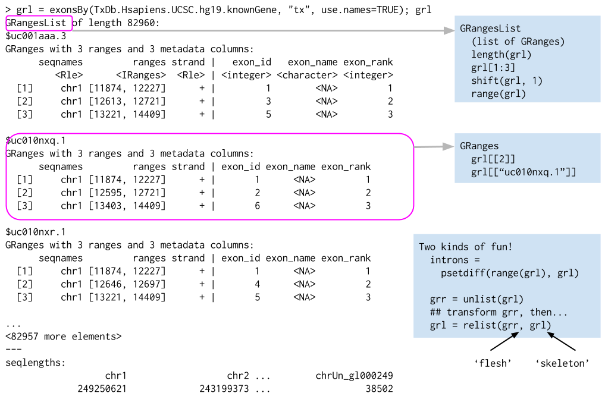

```{r style, echo = FALSE, results = 'asis'}
BiocStyle::markdown()
options(width=100, max.print=1000)
knitr::opts_chunk$set(
    eval=as.logical(Sys.getenv("KNITR_EVAL", "TRUE")),
    cache=as.logical(Sys.getenv("KNITR_CACHE", "TRUE")))
```

```{r packages, eval=TRUE, echo=FALSE, warning=FALSE, message=FALSE}
suppressPackageStartupMessages({
    library(BiocEMBO2015)
})
```

Version: `r packageDescription("BiocEMBO2015")$Version`<br />
Compiled: `r date()`

Objectives

- Overview of sequence analysis work flows
- Key [R](http://cran.r-project.org) and
  [Bioconductor](http://bioconductor.org) concepts and resources.
- Main assumptions: _alignment_ to known _reference_

Time          | Topic                                                       
------------- | -----
09:15 - 10:15 | Sequencing work flows, R, Bioconductor
10:15         | Tea/Coffee break                                            
10:30 - 12:30 | Sequence data, package tour
12:30         | Lunch                                                       
13:30 -14:00  | Scalable computing

# Sequencing work flows

1. Experimental design
    - Keep it simple, e.g., 'control' and 'treatment' groups
    - Replicate within treatments!
2. Wet-lab sequence preparation (figure from http://rnaseq.uoregon.edu/)

    
    
    - Record covariates, including processing day -- likely 'batch effects'

3. (Illumina) Sequencing (Bentley et al., 2008,
   doi:10.1038/nature07517

    

    - Primary output: FASTQ files of short reads and their [quality
      scores](http://en.wikipedia.org/wiki/FASTQ_format#Encoding)

4. Alignment
    - Choose to match task, e.g., [Rsubread][], Bowtie2 good for ChIPseq,
      some forms of RNAseq; BWA, GMAP better for variant calling
    - Primary output: BAM files of aligned reads
5. Reduction
    - e.g., RNASeq 'count table' (simple spreadsheets), DNASeq called
      variants (VCF files), ChIPSeq peaks (BED, WIG files)
6. Analysis
    - Differential expression, peak identification, ...
7. Comprehension
    - Biological context


# Sequence data representations

## DNA / amino acid sequences: FASTA files

Input & manipulation: [Biostrings][]

    >NM_078863_up_2000_chr2L_16764737_f chr2L:16764737-16766736
    gttggtggcccaccagtgccaaaatacacaagaagaagaaacagcatctt
    gacactaaaatgcaaaaattgctttgcgtcaatgactcaaaacgaaaatg
    ...
    atgggtatcaagttgccccgtataaaaggcaagtttaccggttgcacggt
    >NM_001201794_up_2000_chr2L_8382455_f chr2L:8382455-8384454
    ttatttatgtaggcgcccgttcccgcagccaaagcactcagaattccggg
    cgtgtagcgcaacgaccatctacaaggcaatattttgatcgcttgttagg
    ...

Whole genomes: `2bit` and `.fa` formats: [rtracklayer][],
[Rsamtools][]; [BSgenome][]

## Reads: FASTQ files

Input & manipulation: [ShortRead][] `readFastq()`, `FastqStreamer()`,
`FastqSampler()`

    @ERR127302.1703 HWI-EAS350_0441:1:1:1460:19184#0/1
    CCTGAGTGAAGCTGATCTTGATCTACGAAGAGAGATAGATCTTGATCGTCGAGGAGATGCTGACCTTGACCT
    +
    HHGHHGHHHHHHHHDGG<GDGGE@GDGGD<?B8??ADAD<BE@EE8EGDGA3CB85*,77@>>CE?=896=:
    @ERR127302.1704 HWI-EAS350_0441:1:1:1460:16861#0/1
    GCGGTATGCTGGAAGGTGCTCGAATGGAGAGCGCCAGCGCCCCGGCGCTGAGCCGCAGCCTCAGGTCCGCCC
    +
    DE?DD>ED4>EEE>DE8EEEDE8B?EB<@3;BA79?,881B?@73;1?########################
        
- Quality scores: 'phred-like', encoded. See
  [wikipedia](http://en.wikipedia.org/wiki/FASTQ_format#Encoding)

## Aligned reads: BAM files (e.g., ERR127306_chr14.bam)

Input & manipulation: 'low-level' [Rsamtools][], `scanBam()`,
`BamFile()`; 'high-level' [GenomicAlignments][]

- Header

        @HD     VN:1.0  SO:coordinate
        @SQ     SN:chr1 LN:249250621
        @SQ     SN:chr10        LN:135534747
        @SQ     SN:chr11        LN:135006516
        ...
        @SQ     SN:chrY LN:59373566
        @PG     ID:TopHat       VN:2.0.8b       CL:/home/hpages/tophat-2.0.8b.Linux_x86_64/tophat --mate-inner-dist 150 --solexa-quals --max-multihits 5 --no-discordant --no-mixed --coverage-search --microexon-search --library-type fr-unstranded --num-threads 2 --output-dir tophat2_out/ERR127306 /home/hpages/bowtie2-2.1.0/indexes/hg19 fastq/ERR127306_1.fastq fastq/ERR127306_2.fastq
  
- Alignments: ID, flag, alignment and mate
  
        ERR127306.7941162       403     chr14   19653689        3       72M             =       19652348        -1413  ...
        ERR127306.22648137      145     chr14   19653692        1       72M             =       19650044        -3720  ...
        ERR127306.933914        339     chr14   19653707        1       66M120N6M       =       19653686        -213   ...
        ERR127306.11052450      83      chr14   19653707        3       66M120N6M       =       19652348        -1551  ...
        ERR127306.24611331      147     chr14   19653708        1       65M120N7M       =       19653675        -225   ...
        ERR127306.2698854       419     chr14   19653717        0       56M120N16M      =       19653935        290    ...
        ERR127306.2698854       163     chr14   19653717        0       56M120N16M      =       19653935        2019   ...
            
- Alignments: sequence and quality
        
        ... GAATTGATCAGTCTCATCTGAGAGTAACTTTGTACCCATCACTGATTCCTTCTGAGACTGCCTCCACTTCCC        *'%%%%%#&&%''#'&%%%)&&%%$%%'%%'&*****$))$)'')'%)))&)%%%%$'%%%%&"))'')%))
        ... TTGATCAGTCTCATCTGAGAGTAACTTTGTACCCATCACTGATTCCTTCTGAGACTGCCTCCACTTCCCCAG        '**)****)*'*&*********('&)****&***(**')))())%)))&)))*')&***********)****
        ... TGAGAGTAACTTTGTACCCATCACTGATTCCTTCTGAGACTGCCTCCACTTCCCCAGCAGCCTCTGGTTTCT        '******&%)&)))&")')'')'*((******&)&'')'))$))'')&))$)**&&****************
        ... TGAGAGTAACTTTGTACCCATCACTGATTCCTTCTGAGACTGCCTCCACTTCCCCAGCAGCCTCTGGTTTCT        ##&&(#')$')'%&&#)%$#$%"%###&!%))'%%''%'))&))#)&%((%())))%)%)))%*********
        ... GAGAGTAACTTTGTACCCATCACTGATTCCTTCTGAGACTGCCTCCACTTCCCCAGCAGCCTCTGGTTTCTT        )&$'$'$%!&&%&&#!'%'))%''&%'&))))''$""'%'%&%'#'%'"!'')#&)))))%$)%)&'"')))
        ... TTTGTACCCATCACTGATTCCTTCTGAGACTGCCTCCACTTCCCCAGCAGCCTCTGGTTTCTTCATGTGGCT        ++++++++++++++++++++++++++++++++++++++*++++++**++++**+**''**+*+*'*)))*)#
        ... TTTGTACCCATCACTGATTCCTTCTGAGACTGCCTCCACTTCCCCAGCAGCCTCTGGTTTCTTCATGTGGCT        ++++++++++++++++++++++++++++++++++++++*++++++**++++**+**''**+*+*'*)))*)#
        
- Alignments: Tags

        ... AS:i:0  XN:i:0  XM:i:0  XO:i:0  XG:i:0  NM:i:0  MD:Z:72 YT:Z:UU NH:i:2  CC:Z:chr22      CP:i:16189276   HI:i:0
        ... AS:i:0  XN:i:0  XM:i:0  XO:i:0  XG:i:0  NM:i:0  MD:Z:72 YT:Z:UU NH:i:3  CC:Z:=  CP:i:19921600   HI:i:0
        ... AS:i:0  XN:i:0  XM:i:0  XO:i:0  XG:i:0  NM:i:4  MD:Z:72 YT:Z:UU XS:A:+  NH:i:3  CC:Z:=  CP:i:19921465   HI:i:0
        ... AS:i:0  XN:i:0  XM:i:0  XO:i:0  XG:i:0  NM:i:4  MD:Z:72 YT:Z:UU XS:A:+  NH:i:2  CC:Z:chr22      CP:i:16189138   HI:i:0
        ... AS:i:0  XN:i:0  XM:i:0  XO:i:0  XG:i:0  NM:i:5  MD:Z:72 YT:Z:UU XS:A:+  NH:i:3  CC:Z:=  CP:i:19921464   HI:i:0
        ... AS:i:0  XM:i:0  XO:i:0  XG:i:0  MD:Z:72 NM:i:0  XS:A:+  NH:i:5  CC:Z:=  CP:i:19653717   HI:i:0
        ... AS:i:0  XM:i:0  XO:i:0  XG:i:0  MD:Z:72 NM:i:0  XS:A:+  NH:i:5  CC:Z:=  CP:i:19921455   HI:i:1

## Called variants: VCF files

Input and manipulation: [VariantAnnotation][] `readVcf()`,
`readInfo()`, `readGeno()` selectively with `ScanVcfParam()`.

- Header

          ##fileformat=VCFv4.2
          ##fileDate=20090805
          ##source=myImputationProgramV3.1
          ##reference=file:///seq/references/1000GenomesPilot-NCBI36.fasta
          ##contig=<ID=20,length=62435964,assembly=B36,md5=f126cdf8a6e0c7f379d618ff66beb2da,species="Homo sapiens",taxonomy=x>
          ##phasing=partial
          ##INFO=<ID=DP,Number=1,Type=Integer,Description="Total Depth">
          ##INFO=<ID=AF,Number=A,Type=Float,Description="Allele Frequency">
          ...
          ##FILTER=<ID=q10,Description="Quality below 10">
          ##FILTER=<ID=s50,Description="Less than 50% of samples have data">
          ...
          ##FORMAT=<ID=GT,Number=1,Type=String,Description="Genotype">
          ##FORMAT=<ID=GQ,Number=1,Type=Integer,Description="Genotype Quality">
          
- Location

          #CHROM POS     ID        REF    ALT     QUAL FILTER ...
          20     14370   rs6054257 G      A       29   PASS   ...
          20     17330   .         T      A       3    q10    ...
          20     1110696 rs6040355 A      G,T     67   PASS   ...
          20     1230237 .         T      .       47   PASS   ...
          20     1234567 microsat1 GTC    G,GTCT  50   PASS   ...
          
- Variant INFO

          #CHROM POS     ...	INFO                              ...
          20     14370   ...	NS=3;DP=14;AF=0.5;DB;H2           ...
          20     17330   ...	NS=3;DP=11;AF=0.017               ...
          20     1110696 ...	NS=2;DP=10;AF=0.333,0.667;AA=T;DB ...
          20     1230237 ...	NS=3;DP=13;AA=T                   ...
          20     1234567 ...	NS=3;DP=9;AA=G                    ...
    
- Genotype FORMAT and samples

          ... POS     ...  FORMAT      NA00001        NA00002        NA00003
          ... 14370   ...  GT:GQ:DP:HQ 0|0:48:1:51,51 1|0:48:8:51,51 1/1:43:5:.,.
          ... 17330   ...  GT:GQ:DP:HQ 0|0:49:3:58,50 0|1:3:5:65,3   0/0:41:3
          ... 1110696 ...  GT:GQ:DP:HQ 1|2:21:6:23,27 2|1:2:0:18,2   2/2:35:4
          ... 1230237 ...  GT:GQ:DP:HQ 0|0:54:7:56,60 0|0:48:4:51,51 0/0:61:2
          ... 1234567 ...  GT:GQ:DP    0/1:35:4       0/2:17:2       1/1:40:3
            
## Genome annotations: BED, WIG, GTF, etc. files

Input: [rtracklayer][] `import()`

- BED: range-based annotation (see
  http://genome.ucsc.edu/FAQ/FAQformat.html for definition of this and
  related formats)
- WIG / bigWig: dense, continuous-valued data
- GTF: gene model

  - Component coordinates
  
              7   protein_coding  gene        27221129    27224842    .   -   . ...
              ...
              7   protein_coding  transcript  27221134    27224835    .   -   . ...
              7   protein_coding  exon        27224055    27224835    .   -   . ...
              7   protein_coding  CDS         27224055    27224763    .   -   0 ...
              7   protein_coding  start_codon 27224761    27224763    .   -   0 ...
              7   protein_coding  exon        27221134    27222647    .   -   . ...
              7   protein_coding  CDS         27222418    27222647    .   -   2 ...
              7   protein_coding  stop_codon  27222415    27222417    .   -   0 ...
              7   protein_coding  UTR         27224764    27224835    .   -   . ...
              7   protein_coding  UTR         27221134    27222414    .   -   . ...
      
  - Annotations

              gene_id "ENSG00000005073"; gene_name "HOXA11"; gene_source "ensembl_havana"; gene_biotype "protein_coding";
              ...
              ... transcript_id "ENST00000006015"; transcript_name "HOXA11-001"; transcript_source "ensembl_havana"; tag "CCDS"; ccds_id "CCDS5411";
              ... exon_number "1"; exon_id "ENSE00001147062";
              ... exon_number "1"; protein_id "ENSP00000006015";
              ... exon_number "1";
              ... exon_number "2"; exon_id "ENSE00002099557";
              ... exon_number "2"; protein_id "ENSP00000006015";
              ... exon_number "2";
              ...

# R

Language and environment for statistical computing and graphics

- Full-featured programming language
- Interactive and *interpretted* -- convenient and forgiving
- Coherent, extensive documentation
- Statistical, e.g. `factor()`, `NA`
- Extensible -- CRAN, Bioconductor, github, ...

Vector, class, object

- Efficient _vectorized_ calculations on 'atomic' vectors `logical`,
  `integer`, `numeric`, `complex`, `character`, `byte`
- Atomic vectors are building blocks for more complicated _objects_
  - `matrix` -- atomic vector with 'dim' attribute
  - `data.frame` -- list of equal length atomic vectors
- Formal _classes_ represent complicated combinations of vectors,
  e.g., the return value of `lm()`, below

Function, generic, method

- Functions transform inputs to outputs, perhaps with side effects,
  e.g., `rnorm(1000)`
  - Argument matching first by name, then by position
  - Functions may define (some) arguments to have default values
- _Generic_ functions dispatch to specific _methods_ based on class of
  argument(s), e.g., `print()`. 
- Methods are functions that implement specific generics, e.g.,
  `print.factor`; methods are invoked _indirectly_, via the generic.

Introspection

- General properties, e.g., `class()`, `str()`
- Class-specific properties, e.g., `dim()`

Help

- `?print`: help on the generic print 
- `?print.data.frame`: help on print method for objects of class
    data.frame.

Example

```{r}
x <- rnorm(1000)                   # atomic vectors
y <- x + rnorm(1000, sd=.5)
df <- data.frame(x=x, y=y)         # object of class 'data.frame'
plot(y ~ x, df)                    # generic plot, method plot.formula
fit <- lm(y ~x, df)                # object of class 'lm'
methods(class=class(fit))          # introspection
```

# Bioconductor

## Overview

Analysis and comprehension of high-throughput genomic data

- Statistical analysis: large data, technological artifacts, designed
  experiments; rigorous
- Comprehension: biological context, visualization, reproducibility
- High-throughput
  - Sequencing: RNASeq, ChIPSeq, variants, copy number, ...
  - Microarrays: expression, SNP, ...
  - Flow cytometry, proteomics, images, ...

Packages, vignettes, work flows

- 934 packages
- Discover and navigate via [biocViews][]
- Package 'landing page'
  - Title, author / maintainer, short description, citation,
    installation instructions, ..., download statistics
- All user-visible functions have help pages, most with runnable
  examples
- 'Vignettes' an important feature in Bioconductor -- narrative
  documents illustrating how to use the package, with integrated code
- 'Release' (every six months) and 'devel' branches
- [Support site](https://support.bioconductor.org);
  [videos](https://www.youtube.com/user/bioconductor), [recent
  courses](http://bioconductor.org/help/course-materials/)

Objects

- Represent complicated data types
- Foster interoperability
- S4 object system
  - Introspection: `methods()`, `getClass()`, `selectMethod()`
  - 'accessors' and other documented functions / methods for
    manipulation, rather than direct access to the object structure
- Interactive help
  - `method?"substr,<tab>"` to select help on methods, `class?D<tab>`
    for help on classes

Example

```{r Biostrings, message=FALSE}
require(Biostrings)                     # Biological sequences
data(phiX174Phage)                      # sample data, see ?phiX174Phage
phiX174Phage
m <- consensusMatrix(phiX174Phage)[1:4,] # nucl. x position counts
polymorphic <- which(colSums(m != 0) > 1)
m[, polymorphic]
methods(class=class(phiX174Phage))
selectMethod(reverseComplement, class(phiX174Phage))
```


## A sequence analysis package tour

This very open-ended topic points to some of the most prominent
Bioconductor packages for sequence analysis. Use the opportunity in
this lab to explore the package vignettes and help pages highlighted
below; many of the material will be covered in greater detail in
subsequent labs and lectures.

Basics 

- Bioconductor packages are listed on the [biocViews][] page. Each
  package has 'biocViews' (tags from a controlled vocabulary)
  associated with it; these can be searched to identify appropriately
  tagged packages, as can the package title and author.
- Each package has a 'landing page', e.g., for
  [GenomicRanges][]. Visit this landing page, and note the
  description, authors, and installation instructions. Packages are
  often written up in the scientific literature, and if available the
  corresponding citation is present on the landing page. Also on the
  landing page are links to the vignettes and reference manual and, at
  the bottom, an indication of cross-platform availability and
  download statistics.
-   A package needs to be installed once, using the instructions on the
    landing page. Once installed, the package can be loaded into an R
    session

    ```{r require}
    library(GenomicRanges)
    ```
    
    and the help system queried interactively, as outlined above:

    ```{r help, eval=FALSE}
      help(package="GenomicRanges")
      vignette(package="GenomicRanges")
      vignette(package="GenomicRanges", "GenomicRangesHOWTOs")
      ?GRanges
    ```
    
Domain-specific analysis -- explore the landing pages, vignettes, and
reference manuals of two or three of the following packages.

- Important packages for analysis of differential expression include
  [edgeR][] and [DESeq2][]; both have excellent vignettes for
  exploration. Additional research methods embodied in Bioconductor
  packages can be discovered by visiting the [biocViews][] web page,
  searching for the 'DifferentialExpression' view term, and narrowing
  the selection by searching for 'RNA seq' and similar.
- Popular ChIP-seq packages include [csaw][] an d[DiffBind][] for
  comparison of peaks across samples, [ChIPQC][] for quality
  assessment, and [ChIPseeker][] for annotating results (e.g.,
  discovering nearby genes). What other ChIP-seq packages are listed
  on the [biocViews][] page?
- Working with called variants (VCF files) is facilitated by packages
  such as [VariantAnnotation][], [VariantFiltering][], [ensemblVEP][],
  and [SomaticSignatures][]; packages for calling variants include,
  e.g., [h5vc][] and [VariantTools][].
- Several packages identify copy number variants from sequence data,
  including [cn.mops][]; from the [biocViews][] page, what other copy
  number packages are available? The [CNTools][] package provides some
  useful facilities for comparison of segments across samples.
- Microbiome and metagenomic analysis is facilitated by packages such
  as [phyloseq][] and [metagenomeSeq][].
- Metabolomics, chemoinformatics, image analysis, and many other
  high-throughput analysis domains are also represented in
  Bioconductor; explore these via biocViews and title searches.
  
Working with sequences, alignments, common web file formats, and raw
data; these packages rely very heavily on the [IRanges][] /
[GenomicRanges][] infrastructure that we will encounter later in the
course.

- The [Biostrings][] package is used to represent DNA and other
  sequences, with many convenient sequence-related functions. Check
  out the functions documented on the help page `?consensusMatrix`,
  for instance. Also check out the [BSgenome][] package for working
  with whole genome sequences, e.g., `?"getSeq,BSgenome-method"`
- The [GenomicAlignments][] package is used to input reads aligned to
  a reference genome. See for instance the `?readGAlignments` help
  page and `vigentte(package="GenomicAlignments",
  "summarizeOverlaps")`
- [rtracklayer][]'s `import` and `export` functions can read in many
  common file types, e.g., BED, WIG, GTF, ..., in addition to querying
  and navigating the UCSC genome browser. Check out the `?import` page
  for basic usage.
- The [ShortRead][] and [Rsamtools][] packages can be used for
  lower-level access to FASTQ and BAM files, respectively. Explore the
  [ShortRead vignette](http://bioconductor.org/packages/release/bioc/vignettes/ShortRead/inst/doc/Overview.pdf)
  and Scalable Genomics labs to see approaches to effectively
  processing the large files.

Visualization

- The [Gviz][] package provides great tools for visualizing local
  genomic coordinates and associated data. 
- [epivizr][] drives the [epiviz](http://epiviz.cbcb.umd.edu/) genome
  browser from within R; [rtracklayer][] provides easy ways to
  transfer data to and manipulate UCSC browser sessions.
- Additionl packages include [ggbio][], [OmicCircos][], ...

## DNA or amino acid sequences: _Biostrings_, _ShortRead_, _BSgenome_

Classes

- XString, XStringSet, e.g., DNAString (genomes),
  DNAStringSet (reads)

Methods --

- [Cheat sheat](http://bioconductor.org/packages/release/bioc/vignettes/Biostrings/inst/doc/BiostringsQuickOverview.pdf)
- Manipulation, e.g., `reverseComplement()`
- Summary, e.g., `letterFrequency()`
- Matching, e.g., `matchPDict()`, `matchPWM()`

Related packages

- [BSgenome][]
    - Whole-genome representations
    - Model and custom
- [ShortRead][]
    - FASTQ files

Example 

- Whole-genome sequences are distrubuted by ENSEMBL, NCBI, and others
  as FASTA files; model organism whole genome sequences are packaged
  into more user-friendly `BSgenome` packages. The following
  calculates GC content across chr14.

```{r BSgenome-require, message=FALSE}
  require(BSgenome.Hsapiens.UCSC.hg19)
  chr14_range = GRanges("chr14", IRanges(1, seqlengths(Hsapiens)["chr14"]))
  chr14_dna <- getSeq(Hsapiens, chr14_range)
  letterFrequency(chr14_dna, "GC", as.prob=TRUE)
```
  
## Ranges: _GenomicRanges_, _IRanges_

Ranges represent:
- Data, e.g., aligned reads, ChIP peaks, SNPs, CpG islands, ...
- Annotations, e.g., gene models, regulatory elements, methylated
  regions
- Ranges are defined by chromosome, start, end, and strand
- Often, metadata is associated with each range, e.g., quality of
  alignment, strength of ChIP peak

Many common biological questions are range-based
- What reads overlap genes?
- What genes are ChIP peaks nearest?
- ...


The [GenomicRanges][] package defines essential classes and methods

- `GRanges`


- `GRangesList`



### Range operations


Ranges
- IRanges
  - `start()` / `end()` / `width()`
  - List-like -- `length()`, subset, etc.
  - 'metadata', `mcols()`
- GRanges
  - 'seqnames' (chromosome), 'strand'
  - `Seqinfo`, including `seqlevels` and `seqlengths`

Intra-range methods
- Independent of other ranges in the same object
- GRanges variants strand-aware
- `shift()`, `narrow()`, `flank()`, `promoters()`, `resize()`,
  `restrict()`, `trim()`
- See `?"intra-range-methods"`

Inter-range methods
- Depends on other ranges in the same object
- `range()`, `reduce()`, `gaps()`, `disjoin()`
- `coverage()` (!)
- see `?"inter-range-methods"`

Between-range methods
- Functions of two (or more) range objects
- `findOverlaps()`, `countOverlaps()`, ..., `%over%`, `%within%`,
  `%outside%`; `union()`, `intersect()`, `setdiff()`, `punion()`,
  `pintersect()`, `psetdiff()`

Example

```{r ranges, message=FALSE}
require(GenomicRanges)
gr <- GRanges("A", IRanges(c(10, 20, 22), width=5), "+")
shift(gr, 1)                            # 1-based coordinates!
range(gr)                               # intra-range
reduce(gr)                              # inter-range
coverage(gr)
setdiff(range(gr), gr)                  # 'introns'
```

IRangesList, GRangesList
- List: all elements of the same type
- Many *List-aware methods, but a common 'trick': apply a vectorized
  function to the unlisted representaion, then re-list

        grl <- GRangesList(...)
        orig_gr <- unlist(grl)
        transformed_gr <- FUN(orig)
        transformed_grl <- relist(, grl)
        
Reference

- Lawrence M, Huber W, Pagès H, Aboyoun P, Carlson M, et al. (2013)
  Software for Computing and Annotating Genomic Ranges. PLoS Comput
  Biol 9(8): e1003118. doi:10.1371/journal.pcbi.1003118

## Aligned reads: _GenomicAlignments_, _Rsamtools_

Classes -- GenomicRanges-like behaivor

- GAlignments, GAlignmentPairs, GAlignmentsList
- SummarizedExperiment
  - Matrix where rows are indexed by genomic ranges, columns by a
    DataFrame.

Methods

- `readGAlignments()`, `readGAlignmentsList()`
  - Easy to restrict input, iterate in chunks
- `summarizeOverlaps()`

Example

- Find reads supporting the junction identified above, at position
  19653707 + 66M = 19653773 of chromosome 14

```{r bam-require}
require(GenomicRanges)
require(GenomicAlignments)
require(Rsamtools)

## our 'region of interest'
roi <- GRanges("chr14", IRanges(19653773, width=1)) 
## sample data
require('RNAseqData.HNRNPC.bam.chr14')
bf <- BamFile(RNAseqData.HNRNPC.bam.chr14_BAMFILES[[1]], asMates=TRUE)
## alignments, junctions, overlapping our roi
paln <- readGAlignmentsList(bf)
j <- summarizeJunctions(paln, with.revmap=TRUE)
j_overlap <- j[j %over% roi]

## supporting reads
paln[j_overlap$revmap[[1]]]
```
  
## Called variants: _VariantAnnotation_, _VariantFiltering_

Classes -- GenomicRanges-like behavior

- VCF -- 'wide'
- VRanges -- 'tall'

Functions and methods

- I/O and filtering: `readVcf()`, `readGeno()`, `readInfo()`,
  `readGT()`, `writeVcf()`, `filterVcf()`
- Annotation: `locateVariants()` (variants overlapping ranges),
  `predictCoding()`, `summarizeVariants()`
- SNPs: `genotypeToSnpMatrix()`, `snpSummary()`

Example

- Read variants from a VCF file, and annotate with respect to a known
  gene model
  
```{r vcf, message=FALSE}
  ## input variants
  require(VariantAnnotation)
  fl <- system.file("extdata", "chr22.vcf.gz", package="VariantAnnotation")
  vcf <- readVcf(fl, "hg19")
  seqlevels(vcf) <- "chr22"
  ## known gene model
  require(TxDb.Hsapiens.UCSC.hg19.knownGene)
  coding <- locateVariants(rowRanges(vcf),
      TxDb.Hsapiens.UCSC.hg19.knownGene,
      CodingVariants())
  head(coding)
```

Related packages

- [ensemblVEP][] 
    - Forward variants to Ensembl Variant Effect Predictor
- [VariantTools][], [h5vc][]
    - Call variants
- [VariantFiltering][]
    - Filter variants using criteria such as coding consequence, MAF,
       ..., inheritance model

Reference

- Obenchain, V, Lawrence, M, Carey, V, Gogarten, S, Shannon, P, and
  Morgan, M. VariantAnnotation: a Bioconductor package for exploration
  and annotation of genetic variants. Bioinformatics, first published
  online March 28, 2014
  [doi:10.1093/bioinformatics/btu168](http://bioinformatics.oxfordjournals.org/content/early/2014/04/21/bioinformatics.btu168)

## Integrated data representations: _SummarizedExperiment_

[SummarizedExperiment][]

## Annotation: _org_, _TxDb_, _AnnotationHub_, _biomaRt_, ...

- _Bioconductor_ provides extensive access to 'annotation' resources
  (see the [AnnotationData][] biocViews hierarchy); some interesting
  examples to explore during this lab include:
- [biomaRt][], [PSICQUIC][], [KEGGREST][] and other packages for
  querying on-line resources; each of these have informative vignettes.
- [AnnotationDbi][] is a cornerstone of the
  [Annotation Data][AnnotationData] packages provided by Bioconductor.
    - **org** packages (e.g., [org.Hs.eg.db][]) contain maps between
      different gene identifiers, e.g., ENTREZ and SYMBOL. The basic
      interface to these packages is described on the help page `?select`
    - **TxDb** packages (e.g., [TxDb.Hsapiens.UCSC.hg19.knownGene][])
      contain gene models (exon coordinates, exon / transcript
      relationships, etc) derived from common sources such as the hg19
      knownGene track of the UCSC genome browser. These packages can be
      queried, e.g., as described on the `?exonsBy` page to retrieve all
      exons grouped by gene or transcript.
    - **BSgenome** packages (e.g., [BSgenome.Hsapiens.UCSC.hg19][])
      contain whole genomes of model organisms.
- [VariantAnnotation][] and [ensemblVEP][] provide access to sequence
  annotation facilities, e.g., to identify coding variants; see the
  [Introduction to VariantAnnotation](http://bioconductor.org/packages/release/bioc/vignettes/ShortRead/inst/doc/Overview.pdf)
  vignette for a brief introduction.
- Take a quick look at the [annotation work
  flow](http://bioconductor.org/help/workflows/annotation/annotation/)
  on the Bioconductor web site.

# Resources

_R_ / _Bioconductor_

- [Web site][Bioconductor] -- install, learn, use, develop _R_ /
  _Bioconductor_ packages
- [Support](http://support.bioconductor.org) -- seek help and
  guidance; also
  [StackOverflow](http://stackoverflow.com/questions/tagged/r) for _R_
  programming questions
- [biocViews](http://bioconductor.org/packages/release/BiocViews.html)
  -- discover packages
- Package landing pages, e.g.,
  [GenomicRanges](http://bioconductor.org/packages/release/bioc/html/GenomicRanges.html),
  including title, description, authors, installation instructions,
  vignettes (e.g., GenomicRanges '[How
  To](http://bioconductor.org/packages/release/bioc/vignettes/GenomicRanges/inst/doc/GenomicRangesHOWTOs.pdf)'),
  etc.
- [Course](http://bioconductor.org/help/course-materials/) and other
  [help](http://bioconductor.org/help/) material (e.g., videos, EdX
  course, community blogs, ...)

Publications (General _Bioconductor_)

- Lawrence M, Huber W, Pagès H, Aboyoun P, Carlson M, et al. (2013)
  Software for Computing and Annotating Genomic Ranges. PLoS Comput
  Biol 9(8): e1003118. doi:
  [10.1371/journal.pcbi.1003118][GRanges.bib]
- Lawrence, M, and Morgan, M. 2014. Scalable Genomics with R and
  Bioconductor. Statistical Science 2014, Vol. 29, No. 2,
  214-226. [http://arxiv.org/abs/1409.2864v1][Scalable.bib]

Other

- Lawrence, M. 2014. Software for Enabling Genomic Data
  Analysis. Bioc2014 conference [slides][Lawrence.bioc2014.bib].

<!-- Bibliography -->

[R]: http://r-project.org
[Bioconductor]: http://bioconductor.org
[GRanges.bib]: http://dx.doi.org/10.1371/journal.pcbi.1003118
[Scalable.bib]: http://arxiv.org/abs/1409.2864
[Lawrence.bioc2014.bib]:
    http://bioconductor.org/help/course-materials/2014/BioC2014/Lawrence_Talk.pdf


[AnnotationData]: http://bioconductor.org/packages/release/BiocViews.html#___AnnotationData
[biocViews]: http://bioconductor.org/packages/release/BiocViews.html#___Software

[AnnotationDbi]: http://bioconductor.org/packages/AnnotationDbi
[AnnotationHub]: http://bioconductor.org/packages/AnnotationHub
[BSgenome.Hsapiens.UCSC.hg19]: http://bioconductor.org/packages/BSgenome.Hsapiens.UCSC.hg19
[BSgenome]: http://bioconductor.org/packages/BSgenome
[BiocParallel]: http://bioconductor.org/packages/BiocParallel
[Biostrings]: http://bioconductor.org/packages/Biostrings
[CNTools]: http://bioconductor.org/packages/CNTools
[ChIPQC]: http://bioconductor.org/packages/ChIPQC
[ChIPseeker]: http://bioconductor.org/packages/ChIPseeker
[DESeq2]: http://bioconductor.org/packages/DESeq2
[DiffBind]: http://bioconductor.org/packages/DiffBind
[GenomicAlignments]: http://bioconductor.org/packages/GenomicAlignments
[GenomicFiles]: http://bioconductor.org/packages/GenomicFiles
[GenomicRanges]: http://bioconductor.org/packages/GenomicRanges
[Homo.sapiens]: http://bioconductor.org/packages/Homo.sapiens
[IRanges]: http://bioconductor.org/packages/IRanges
[KEGGREST]: http://bioconductor.org/packages/KEGGREST
[PSICQUIC]: http://bioconductor.org/packages/PSICQUIC
[Rsamtools]: http://bioconductor.org/packages/Rsamtools
[Rsubread]: http://bioconductor.org/packages/Rsubread
[ShortRead]: http://bioconductor.org/packages/ShortRead
[SomaticSignatures]: http://bioconductor.org/packages/SomaticSignatures
[SummarizedExperiment]: http://bioconductor.org/packages/SummarizedExperiment
[TxDb.Hsapiens.UCSC.hg19.knownGene]: http://bioconductor.org/packages/TxDb.Hsapiens.UCSC.hg19.knownGene
[VariantAnnotation]: http://bioconductor.org/packages/VariantAnnotation
[VariantFiltering]: http://bioconductor.org/packages/VariantFiltering
[VariantTools]: http://bioconductor.org/packages/VariantTools
[biomaRt]: http://bioconductor.org/packages/biomaRt
[cn.mops]: http://bioconductor.org/packages/cn.mops
[csaw]: http://bioconductor.org/packages/csaw
[edgeR]: http://bioconductor.org/packages/edgeR
[ensemblVEP]: http://bioconductor.org/packages/ensemblVEP 
[h5vc]: http://bioconductor.org/packages/h5vc
[limma]: http://bioconductor.org/packages/limma
[metagenomeSeq]: http://bioconductor.org/packages/metagenomeSeq
[org.Hs.eg.db]: http://bioconductor.org/packages/org.Hs.eg.db
[org.Sc.sgd.db]: http://bioconductor.org/packages/org.Sc.sgd.db
[phyloseq]: http://bioconductor.org/packages/phyloseq
[rtracklayer]: http://bioconductor.org/packages/rtracklayer
[snpStats]: http://bioconductor.org/packages/snpStats
[Gviz]: http://bioconductor.org/packages/Gviz
[epivizr]: http://bioconductor.org/packages/epivizr
[ggbio]: http://bioconductor.org/packages/ggbio
[OmicCircos]: http://bioconductor.org/packages/OmicCircos
